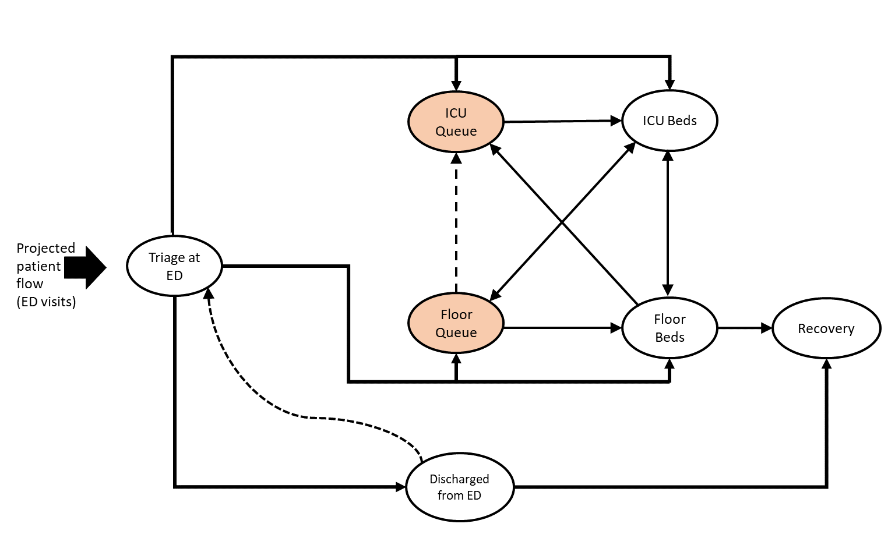

### **MODEL STRUCTURE**

 

#### **This model captures some of the most important ways COVID19+ patients move through a hospital.**

COVID19+ patients enter the hospital through the emergency department (ED), where they are triaged to the ICU, the general medicine
floor, or discharge as necessary.  If bed capacity is reached, these patients enter floor or ICU queues until a bed opens.  Patients 
move between the queues and between the floor and ICU depending on their status.  Deaths may occur while waiting in queues, on the floor,
in the ICU, and post-discharge from the ED.  

 

 